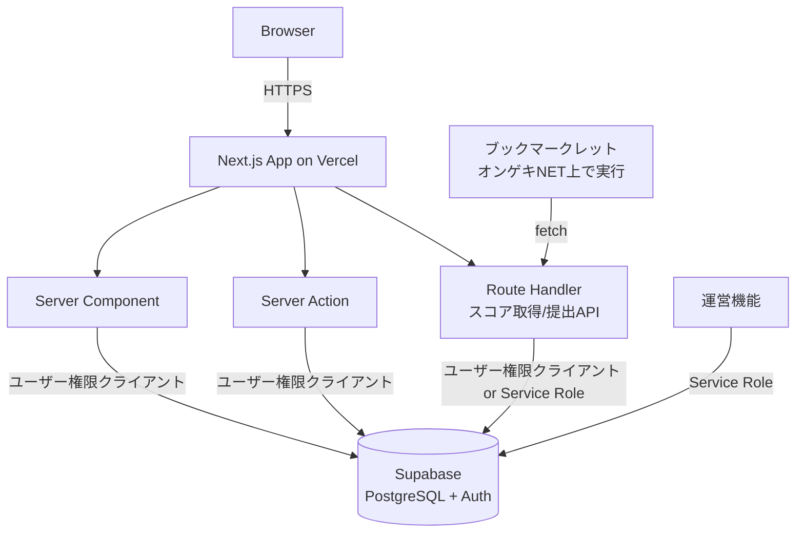

# Architecture

## System Architecture

## Frontend
- Next.js App Routerを使用し、Server Componentを基本とする（`.claude/rules/coding_style.md`参照）。
- Client Componentは、インタラクティブなUI（フォーム入力、ダイアログ、通知の既読操作など）に限定して使用する。
- フロントエンドからSupabaseクライアントを直接利用してテーブルへアクセスすることは行わない。データ取得・更新は必ずServer Component / Server Action / Route Handlerを経由する。

## Backend
- Server Action: フォーム送信等、ページ内で完結するミューテーション（大会作成、1v1作成、参加、プロフィール編集等）に使用する。
- Route Handler: 以下の用途に使用する。
  - ブックマークレットからの外部呼び出しを受けるスコア取得・提出API（`api.md`参照）。
  - Webhook等、外部からのHTTPリクエストを受ける処理。
- いずれの場合も、通常のユーザー操作はログインユーザーの権限で動作するSupabaseクライアント（RLS適用）を使用し、運営機能やユーザー登録等の特権操作のみService Roleクライアントを使用する。

## Database
- Supabase（PostgreSQL）を使用する。テーブル設計は`./database.md`を参照。
- `prj_docs/domain/entities.md`のエンティティ・値オブジェクトを正とし、テーブル・カラムへマッピングする。

## External Services
- Supabase: データベース、認証（Supabase Auth）。
- Vercel: ホスティング、デプロイ。
- オンゲキNET: スコアデータの取得元（ユーザーのブラウザ上でブックマークレットが直接アクセスする。当システムのサーバーから直接アクセスすることはない）。
- Pongeki: 楽曲・譜面マスタデータの取得元（運営操作による手動更新、`musics_charts.md`参照）。

## Data Flow
### 通常のページ表示・操作
1. ブラウザがNext.jsアプリにアクセスする。
2. Server Componentが、ユーザー権限付きSupabaseクライアントでデータを取得し、HTMLを描画する。
3. ユーザー操作（作成・編集・参加等）はServer Action経由でSupabaseへ反映される。

### スコア提出（ブックマークレット経由）
1. ユーザーがオンゲキNETにログインした状態でブックマークレットを実行する。
2. ブックマークレットがオンゲキNET上でプレイ履歴（一覧/詳細）を取得する。
3. ブックマークレットが当システムのRoute Handlerへ取得したデータをPOSTする。
4. Route Handlerがバリデーション（`score.md`参照）を行い、別タブで開かれるスコア提出確認ページへ受け渡す。
5. ユーザーが内容を確認し提出を確定すると、Route Handlerまたは Server Actionが`ScoreSubmission`を永続化し、ランキング/コース結果を更新する。

## Authentication Flow
- Supabase Authを認証基盤として使用する（`./authentication.md`参照）。
- ユーザーはuserId（システム内の独自ログインID）とパスワードでログインする。要件上メールアドレスを収集しないため、サーバー側でuserIdから内部疑似メールアドレス（例: `{userId}@geki-arena.internal`）を解決し、Supabase Authへ認証リクエストを行う。
- 認証成功後、Supabaseが発行するセッション（アクセストークン/リフレッシュトークン）を、`@supabase/ssr`を通じてhttpOnly Cookieに保存する。

## Error Handling
- `.claude/rules/coding_style.md`の方針に従い、エラーは適切にキャッチしログに記録、ユーザーには一般化したメッセージを返す。
- Route Handler / Server Actionでは、共通エラーハンドリング関数を通じて、統一されたエラーレスポンス形式（`api.md`参照）に変換する。
- 想定外のエラーは、詳細（スタックトレース等の機微情報）をユーザーに返さず、サーバーログにのみ記録する。

## Background Jobs
- 現時点では、独立したジョブキュー基盤は導入しない。スコア提出・バリデーション・ランキング更新は、いずれもリクエスト同期処理内で完結させる。
- 楽曲・譜面情報の更新（Pongeki連携）は、運営ページからの手動トリガーによる同期処理とする（`musics_charts.md`参照）。処理時間が実用上問題になる場合は、将来的にジョブキュー化を検討する。

## Caching
- 大会ランキング等、参照頻度が高く更新頻度が相対的に低いデータについては、Next.jsのキャッシュ機構（`fetch`キャッシュ、`revalidateTag`/`revalidatePath`等）の活用を想定する。
- 詳細なキャッシュキー設計・再検証タイミングは実装時に確定する。
