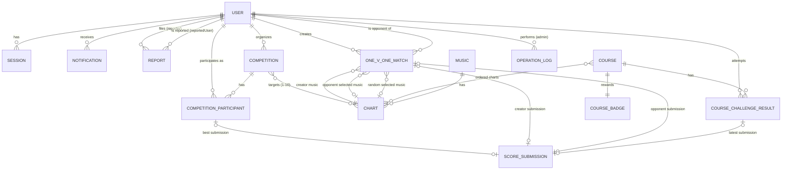

# Entity Relationships

## Purpose
`entities.md`で定義したエンティティ・値オブジェクト間の関連と、集約（Aggregate）の境界を示す。

## ER Diagram

※`SONG_SCORE`は`ScoreSubmission`に内包される値オブジェクトであるため、独立したエンティティとしては図示しない。

## Aggregates（集約）
ドメインの一貫性境界となる集約を以下に示す。集約外のエンティティへはIDによる参照のみを行う。

### User集約
- ルート: `User`
- 内包: `Session`, `CourseBadge`（獲得済みバッジ一覧）
- 外部参照: `RatingClass`（値オブジェクトとして保持）

### Competition集約
- ルート: `Competition`
- 内包: `CompetitionParticipant`
- 外部参照: `User`（organizer, participant）, `Chart`（targetCharts）, `ScoreSubmission`（bestSubmission）

### OneVOneMatch集約
- ルート: `OneVOneMatch`
- 内包: なし（creator/opponentの選択曲・提出は属性として保持）
- 外部参照: `User`（creator, opponent）, `Chart`（各選択曲）, `ScoreSubmission`

### Course集約
- ルート: `Course`
- 内包: `CourseBadge`（報酬定義）
- 外部参照: `Chart`（orderedCharts）

### CourseChallengeResult集約
- ルート: `CourseChallengeResult`
- 外部参照: `User`, `Course`, `ScoreSubmission`
- Course集約とは別集約とする（ユーザーごとの挑戦記録はCourseのライフサイクルと独立して更新されるため）。

### ScoreSubmission集約
- ルート: `ScoreSubmission`
- 内包: `SongScore`（値オブジェクトのリスト）
- 外部参照: `User`（submitter）, 提出先コンテキスト（`Competition` / `OneVOneMatch` / `Course`）

### Report / Notification / OperationLog
- いずれも独立した集約として扱う。`User`への参照はIDのみ保持する。

## Relationship Notes
- `Competition` - `Chart`: 大会は1〜10件の`Chart`を課題曲として参照する（多対多）。
- `User` - `CompetitionParticipant`: ユーザーは複数の大会に参加しうる（多対多の中間に属性を持つため中間エンティティ化）。
- `OneVOneMatch`は`User`間の対戦であり、creator/opponentの2ロールを持つ固定構造のため、専用の中間エンティティを設けず`OneVOneMatch`自体に両ユーザーへの参照を持たせる。
- `Course` - `CourseChallengeResult` - `User`: コースへの挑戦結果はユーザー×コースの組み合わせごとに最新のベスト記録を1件保持する。
- `ScoreSubmission`は大会・1v1・コースのいずれの文脈からも生成されうる汎用エンティティであり、`context`属性でどの集約向けの提出かを判別する。
