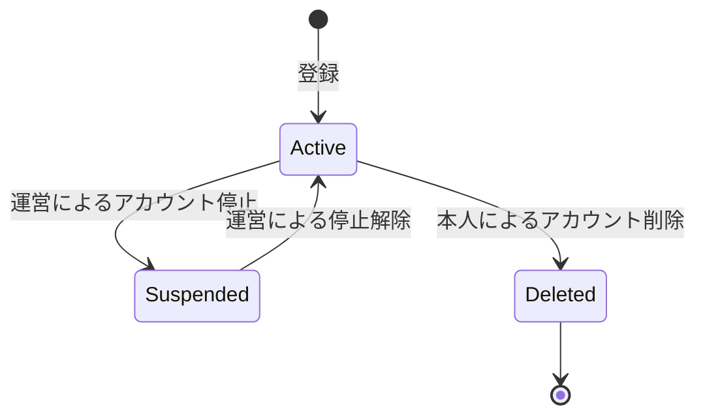
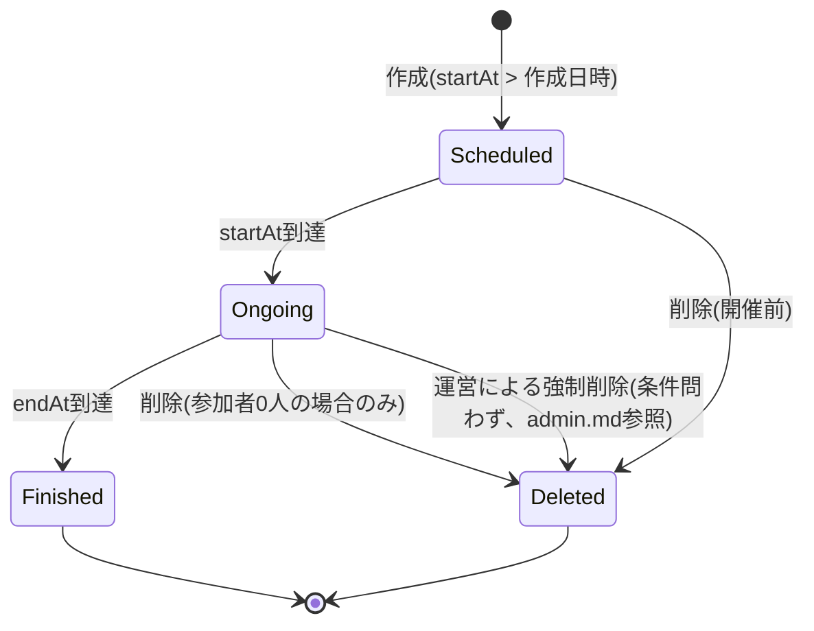
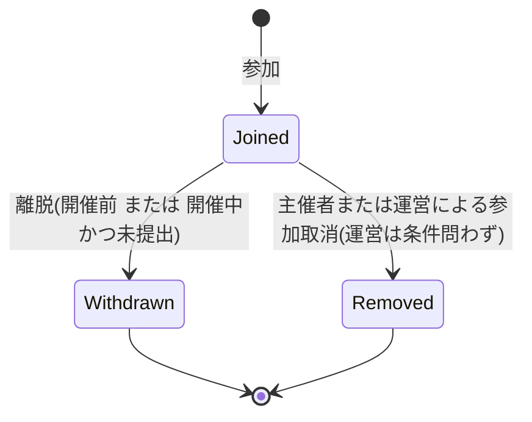
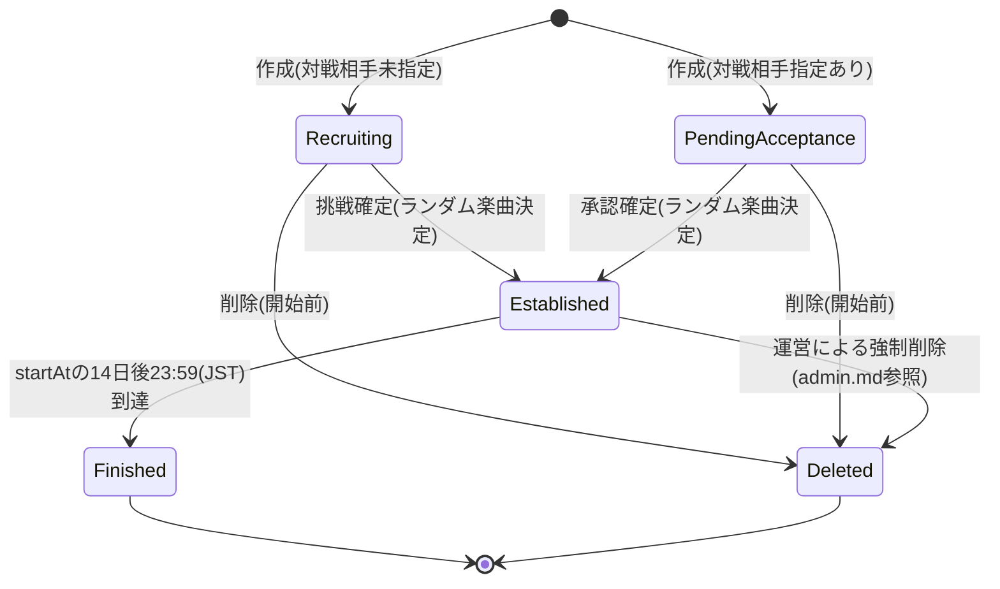
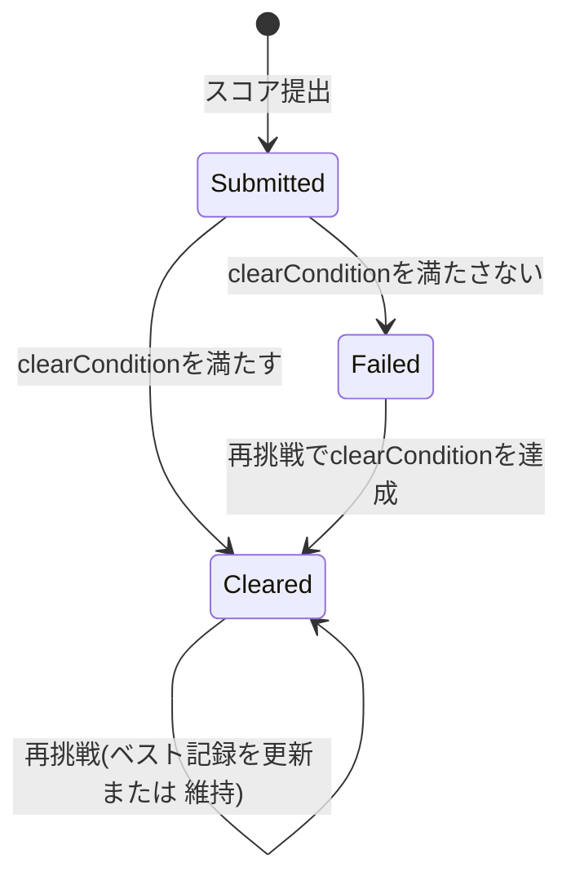
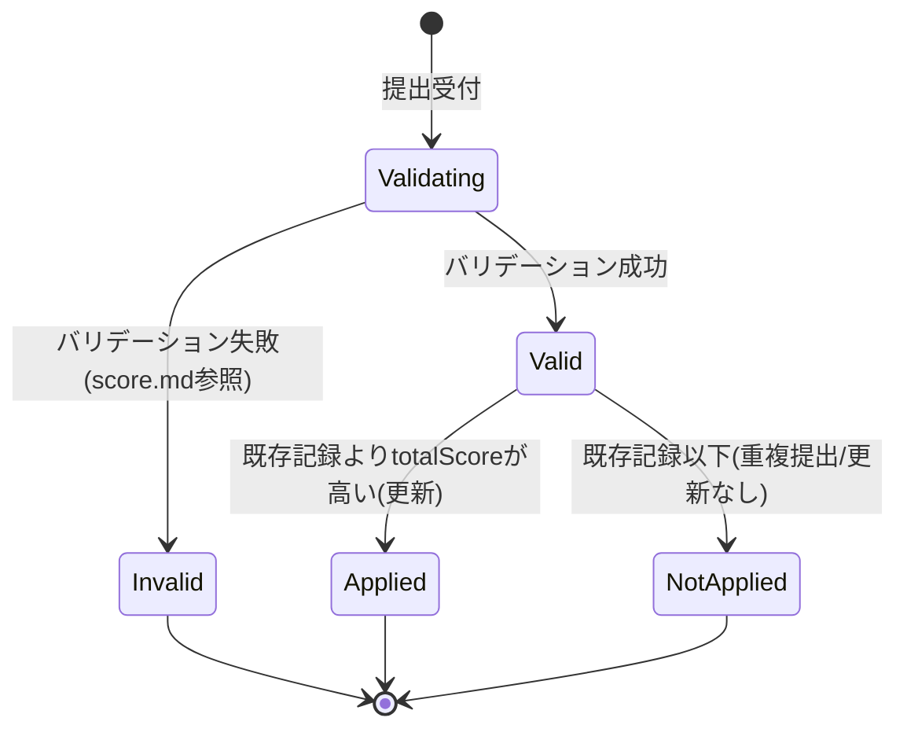
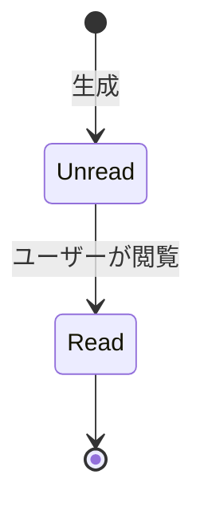
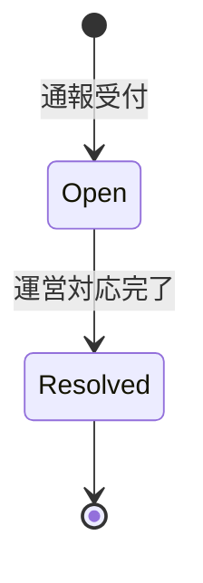

# State Transitions

## Purpose
主要エンティティのライフサイクル（状態遷移）を示す。各状態・遷移条件は`prj_docs/requirements`の記述に基づく。

## User（アカウント状態）

- 出典: `authentication.md`

## Competition（開催状態）
- status（scheduled/ongoing/finished）は日時により導出される値であり、削除のみが明示的な操作。

- 出典: `competition.md`

## CompetitionParticipant（参加状態）

- 出典: `competition.md`

## OneVOneMatch（対戦成立状態）

- 出典: `one-v-one.md`

## CourseChallengeResult（コース挑戦結果）

- 出典: `course.md`, `score.md`

## ScoreSubmission（提出・検証フロー）

- 出典: `score.md`

## Notification（既読状態）

- 出典: `notification.md`

## Report（通報対応状態）

- 出典: `user.md`, `admin.md`
- ※対応フローの詳細は要件未定義のため、ドメイン設計上の簡易な仮定として記載。
